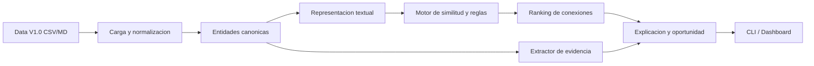

# Dia 1 - Revision tecnica

Este documento resume que mostrar durante las dos revisiones del primer dia.

## Revision inicial

Objetivo de la revision:

Demostrar que entendimos la data, el problema, la estrategia tecnica, la arquitectura inicial y como se integraran las fuentes.

### 1. Comprension del problema

Knowledge Nexus LATAM no pide un buscador documental ni un chatbot generico. El reto consiste en transformar informacion academica dispersa en conexiones utiles, priorizadas, explicables y trazables.

La solucion debe responder siete preguntas:

- Que conecto.
- Como se relaciona.
- Que tan relevante es.
- Por que es relevante.
- Con que evidencia se sustenta.
- De donde proviene la evidencia.
- Para que sirve la conexion.

### 2. Comprension de la data

La data se organiza en tres bloques:

- `01_institution`: facultades, programas, grupos, lineas y capacidades institucionales.
- `02_people_curriculum`: investigadores, expertise, asignaturas, competencias y resultados de aprendizaje.
- `03_knowledge_needs`: necesidades, proyectos, tesis, publicaciones y documentos complementarios.

Los IDs canonicos permiten integrar tablas y sostener trazabilidad:

- `need_id`
- `project_id`
- `thesis_id`
- `publication_id`
- `researcher_id`
- `group_id`
- `program_id`
- `subject_id`
- `capability_id`

### 3. Estrategia tecnica inicial

Enfoque MVP:

1. Cargar las fuentes oficiales sin modificar los archivos originales.
2. Convertir cada registro importante en una entidad canonica.
3. Construir un texto semantico por entidad usando campos relevantes.
4. Calcular similitud y senales de relacion entre entidades.
5. Priorizar conexiones con un score interpretable.
6. Mostrar evidencia por archivo, entidad y campo.
7. Generar una oportunidad accionable basada en la conexion.

### 4. Arquitectura inicial



### 5. Decisiones tecnicas defendibles

- Se empieza con un motor local sin dependencias complejas para asegurar reproducibilidad.
- Se usa TF-IDF/coseno como baseline interpretable.
- Se incorpora expansion semantica simple para capturar sinonimos y terminos relacionados.
- Se conserva trazabilidad hacia `archivo / ID / campo`.
- Se balancean tipos de entidad para demostrar integracion entre investigacion, personas, capacidades y curriculo.

## Revision de avance

Objetivo de la revision:

Mostrar un primer flujo funcional con conexiones iniciales, criterio de priorizacion y evidencia disponible.

### Demo sugerida

Usar la necesidad:

`NEED-001 - Prediccion y prevencion de desercion estudiantil`

Por que es buen caso:

- Conecta con proyectos sobre permanencia estudiantil, riesgo academico y trayectorias educativas.
- Conecta con tesis sobre permanencia, riesgo y analitica educativa.
- Conecta con investigadores con experiencia en permanencia estudiantil.
- Conecta con asignaturas como analitica educativa e investigacion educativa.
- Permite mostrar sinonimos como `desercion`, `permanencia` y `student attrition`.

### Comando de demo

```powershell
& "C:\Users\pc\.cache\codex-runtimes\codex-primary-runtime\dependencies\python\python.exe" .\mvp_knowledge_nexus\knowledge_nexus.py --need NEED-001 --top 12
```

### Que mostrar en la salida

Para cada conexion:

- Entidad origen: necesidad institucional.
- Entidad destino: proyecto, tesis, investigador, capacidad, asignatura o publicacion.
- Tipo de relacion.
- Score y prioridad.
- Explicacion breve.
- Evidencia concreta.
- Oportunidad generada.

Ejemplo de trazabilidad:

`Data V1.0 / 03_knowledge_needs/projects.csv / PRJ-001 / abstract`

### Criterio de priorizacion actual

El score combina:

- Similitud textual ponderada entre entidades.
- Coincidencias directas entre terminos relevantes.
- Senales semanticas relacionadas mediante expansion controlada.

La prioridad se expresa como:

- `HIGH`: conexion fuerte y defendible.
- `MEDIUM`: conexion util, pero requiere revision.
- `LOW`: conexion exploratoria o indirecta.

### Evidencia disponible

El MVP muestra evidencia verificable desde los campos de Data V1.0. No presenta contenido generado como evidencia institucional.

Cada resultado intenta mantener esta cadena:

`necesidad -> entidad relacionada -> relacion -> score -> explicacion -> evidencia -> oportunidad`

## Checklist antes de hablar con evaluadores

- Tenemos claro que no estamos construyendo solo un buscador.
- Podemos explicar los tres bloques de datos.
- Podemos decir que los IDs son la base de integracion y trazabilidad.
- Tenemos un caso demo funcional con `NEED-001`.
- Podemos mostrar evidencia archivo/ID/campo.
- Podemos explicar como se calcula la prioridad.
- Podemos reconocer limitaciones actuales sin sobredimensionar el prototipo.
- Podemos decir cual es el siguiente paso: dashboard, grafo, mejores embeddings y metricas.

## Limitaciones que conviene declarar

- El MVP actual es un baseline interpretable, no el sistema final.
- La expansion semantica aun es pequena y manual.
- El score inicial sirve para priorizar, no para afirmar verdad absoluta.
- Falta incorporar documentos Markdown complementarios.
- Falta dashboard visual para exploracion mas comoda.
- Faltan metricas formales como cobertura de evidencia, latencia o precision evaluada manualmente.

## Siguiente iteracion

Convertir el CLI en una interfaz web sencilla:

- Selector de necesidad institucional.
- Filtros por tipo de entidad.
- Ranking de conexiones.
- Panel de evidencia.
- Panel de oportunidad.
- Vista resumida tipo grafo o red de conexiones.
