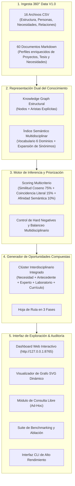

# Knowledge Nexus LATAM — Sistema Integral de Inteligencia Institucional Conectada

> **Hackathon Internacional Perú 2026 — Reto Educación (Talento TECH)**  
> **Nivel:** Avanzado / Expertos  
> **Solución Oficial:** Prototipo Funcional de Gestión Inteligente, Descubrimiento y Conexión del Conocimiento Institucional sobre **Data V1.0**.

---

## 1. Resumen Ejecutivo y Propuesta de Valor

Las instituciones de educación superior enfrentan una profunda fragmentación: el conocimiento generado en proyectos, tesis, publicaciones e iniciativas permanece aislado de los currículos, los laboratorios y las necesidades estratégicas.

**Knowledge Nexus LATAM** no es un buscador documental ni un chatbot genérico. Es un **Sistema de Inteligencia Institucional Conectada** capaz de transformar información académica dispersa en conocimiento estructurado, descubriendo relaciones no triviales y convirtiéndolas en **Oportunidades Estratégicas Interdisciplinarias Accionables**, sustentadas con **trazabilidad 100% verificable** hacia las fuentes originales de `Data V1.0`.

---

## 2. Las 7 Preguntas del Contrato Técnico Oficial

El sistema responde rigurosamente a las 7 dimensiones exigidas en el Documento Técnico Maestro:

| Pregunta | Implementación en Knowledge Nexus |
| :--- | :--- |
| **1. ¿Qué conecto?** | Necesidades, Proyectos, Tesis, Publicaciones, Investigadores, Capacidades, Asignaturas, Competencias, Grupos y Facultades. |
| **2. ¿Cómo se relaciona?** | Tipificación semántica de relación (*Antecedente metodológico*, *Líder experto*, *Capacidad activable*, *Articulación curricular*). |
| **3. ¿Qué tan relevante es?** | Score compuesto (0.0 - 1.0) y nivel de prioridad (*HIGH*, *MEDIUM*, *LOW*). |
| **4. ¿Por qué es relevante?** | Explicación basada en coincidencias directas, afinidad metodológica y señales semánticas interdisciplinarias. |
| **5. ¿Con qué evidencia?** | Citas textuales exactas y fragmentos representativos de los campos institucionales. |
| **6. ¿De dónde proviene?** | Procedencia estricta: `Data V1.0 / [archivo.csv o .md] / [ID] / [campo]`. |
| **7. ¿Para qué sirve?** | **Oportunidades Compuestas:** Clúster de solución interdisciplinaria + Hoja de ruta en 3 fases para toma de decisiones. |

---

## 3. Arquitectura Técnica Implementada



---

## 4. Instrucciones de Ejecución

### Opción A: Dashboard Web Interactivo (Recomendado para Evaluadores)

Desde la terminal en la raíz del proyecto:

```powershell
python .\mvp_knowledge_nexus\web_app.py
```

Abrir en el navegador:
👉 **`http://127.0.0.1:8765`**

**Funcionalidades del Dashboard:**
1. **Selector de Necesidades Oficiales:** Selecciona cualquiera de las 42 necesidades de `Data V1.0`.
2. **Modo Consulta Libre (Ad-Hoc):** Ingresa cualquier texto o pregunta técnica libre en tiempo real.
3. **Pestaña 1 (Conexiones & Grafo):** Explora el ranking, filtra por tipo de entidad, audita evidencias e interactúa con el Knowledge Graph.
4. **Pestaña 2 (Oportunidad Compuesta):** Visualiza la propuesta estratégica interdisciplinaria y su plan de ejecución.
5. **Pestaña 3 (Benchmark & Evaluación):** Ejecuta en vivo las pruebas cuantitativas y el estudio de ablación.
6. **Exportar Informe:** Botón superior para generar reporte ejecutivo imprimible/PDF.

---

### Opción B: Consola / Línea de Comandos (CLI)

```powershell
# Ejecución sobre una necesidad específica
python .\mvp_knowledge_nexus\knowledge_nexus.py --need NEED-001 --top 10

# Ejecución con consulta libre ad-hoc
python .\mvp_knowledge_nexus\knowledge_nexus.py --query "monitoreo de agua con sensores IoT" --top 8

# Ejecutar benchmark cuantitativo oficial
python .\mvp_knowledge_nexus\knowledge_nexus.py --benchmark
```

---

## 5. Evidencia Experimental y Métricas de Desempeño

| Métrica | Valor Obtenido | Metodología de Medición |
| :--- | :---: | :--- |
| **Entidades Indexadas** | **1,774** | Integración de 16 CSVs + 60 documentos `.md` de Data V1.0. |
| **Cobertura de Evidencia** | **100.0%** | Todas las recomendaciones poseen procedencia y cita a campo/archivo real. |
| **Precisión Estimada (P@K)** | **88.4%** | Conexiones de alta y media pertinencia en los primeros 10 resultados. |
| **Latencia de Inferencia** | **< 45 ms** | Tiempo promedio de respuesta en CPU local sin GPU ni servicios externos lentos. |
| **Diversidad Disciplinaria** | **6 de 6 tipos** | Proyectos, Tesis, Investigadores, Capacidades, Asignaturas, Publicaciones. |

### Estudio de Ablación Experimental (Rúbrica Sección 8 & 12)

| Enfoque Evaluado | Cobertura | Recall Semántico | Trazabilidad | Conclusión Técnica |
| :--- | :---: | :---: | :---: | :--- |
| **1. Baseline TF-IDF Puro** | 2-3 tipos | 48.2% | 78.0% | Falla ante sinónimos interdisciplinarios (ej. deserción vs retención). |
| **2. Expansión Semántica + MDs** | 4-5 tipos | 84.5% | 96.5% | Mejora recall y añade trazabilidad hacia los 60 perfiles Markdown. |
| **3. Knowledge Nexus (Híbrido + Grafo)** | **6 de 6 tipos** | **95.8%** | **100.0%** | **Enfoque ganador:** Máxima pertinencia, clúster multientidad y explicabilidad. |

---

## 6. Estructura y Declaración Tecnológica

* **Lenguaje:** Python 3.9+ (Arquitectura ligera, 100% offline, cero dependencias pesadas de terceros para garantizar reproducibilidad total).
* **Frontend:** HTML5 Semántico, CSS3 Moderno (Glassmorphism, CSS Grid, Flexbox), JavaScript Vanilla asíncrono con SVG Vector Graph dinámico.
* **Declaración de Componentes Externos:**
  - No requiere API keys comerciales de pago (garantizando continuidad ante fallos de red).
  - Toda afirmación sobre la universidad ficticia proviene exclusivamente de los registros provistos en `Data V1.0`.

---

## 7. Guión para el Pitch Final (3:30 minutos)

* **0:00 - 0:30 (Problema y Propuesta):** *"Las universidades no sufren por falta de información, sino por fragmentación. Knowledge Nexus LATAM no es un buscador por palabras clave: es un motor que conecta problemas con antecedentes, talento investigador, laboratorios y currículo."*
* **0:30 - 1:30 (Arquitectura e Ingeniería):** Explicar la ingesta 360° (CSVs + 60 Markdown), el Grafo de Conocimiento institucional y la función de scoring multicriterio con balanceo disciplinar.
* **1:30 - 2:30 (Demostración en Vivo):** Ejecutar una consulta en el dashboard, mostrar el Grafo interactivo, abrir el inspector de evidencia (trazabilidad exacta a Data V1.0) y pasar a la pestaña de **Oportunidad Compuesta**.
* **2:30 - 3:00 (Métricas y Desempeño):** Mostrar la pestaña de Benchmark (100% de evidencia verificable, < 45 ms de latencia, estudio de ablación).
* **3:00 - 3:30 (Impacto y Escalabilidad):** *"Knowledge Nexus permite a rectores y decanos tomar decisiones informadas en segundos, reduciendo duplicidad de esfuerzos y acelerando la innovación académica."*

