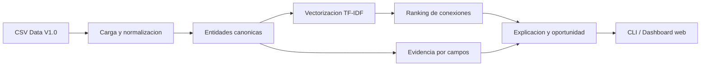

# Knowledge Nexus LATAM - MVP

Primer prototipo funcional para el reto de educacion. El objetivo es demostrar un flujo end-to-end:

`necesidad institucional -> conexiones priorizadas -> evidencia -> oportunidad`

## Ejecucion

### Dashboard web

```powershell
& "C:\Users\pc\.cache\codex-runtimes\codex-primary-runtime\dependencies\python\python.exe" .\mvp_knowledge_nexus\web_app.py
```

Luego abrir:

`http://127.0.0.1:8765`

### Consola

Desde la raiz del material:

```powershell
& "C:\Users\pc\.cache\codex-runtimes\codex-primary-runtime\dependencies\python\python.exe" .\mvp_knowledge_nexus\knowledge_nexus.py --need NEED-001 --top 10
```

Tambien puedes cambiar la necesidad:

```powershell
& "C:\Users\pc\.cache\codex-runtimes\codex-primary-runtime\dependencies\python\python.exe" .\mvp_knowledge_nexus\knowledge_nexus.py --need NEED-005 --top 8
```

Por defecto la salida balancea tipos de entidad para mostrar proyectos, tesis, investigadores,
capacidades, asignaturas y publicaciones. Para ver solo el ranking global por score:

```powershell
& "C:\Users\pc\.cache\codex-runtimes\codex-primary-runtime\dependencies\python\python.exe" .\mvp_knowledge_nexus\knowledge_nexus.py --need NEED-001 --top 10 --ranking-only
```

## Que hace

- Carga entidades desde los CSV oficiales de Data V1.0.
- Construye un texto semantico por entidad.
- Calcula una similitud TF-IDF/coseno con expansion simple de sinonimos.
- Prioriza resultados.
- Devuelve relacion, score, explicacion, evidencia y fuente exacta.
- Propone una oportunidad accionable por conexion.
- Expone un dashboard local y endpoints API para demostracion.

## Entidades usadas

- Necesidades institucionales.
- Proyectos.
- Tesis.
- Publicaciones.
- Investigadores.
- Capacidades institucionales.
- Asignaturas.

## Arquitectura



## Limitaciones actuales

- No usa embeddings profundos todavia.
- La expansion de sinonimos es manual y pequena.
- El score es una primera senal de pertinencia, no una verdad.
- La interfaz inicial es CLI; puede convertirse en dashboard web.
